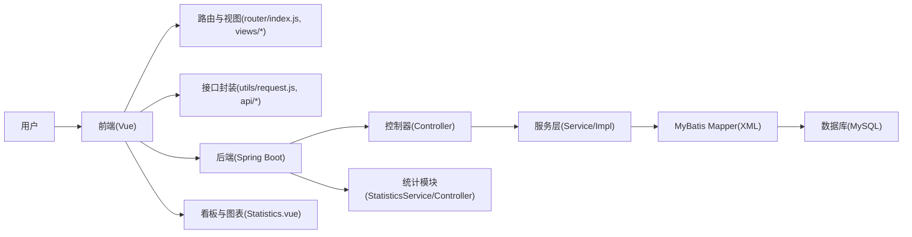
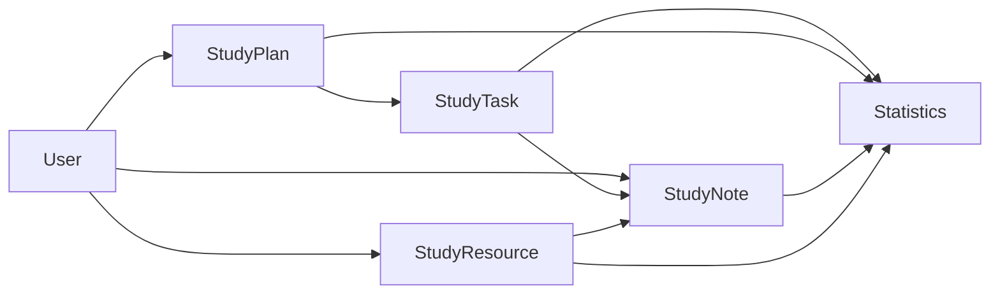
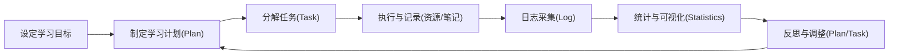

# 在校学生个人学习规划平台 开题报告（首稿）

摘要：在信息化学习环境下，学生面临多课程、多任务、多资源的自我管理挑战。本文拟构建一体化个人学习规划平台，围绕“计划-任务-资源-笔记-统计”闭环，提供学习计划制定、任务分解与跟踪、资源组织与检索、笔记记录与复盘、学习日志统计与可视化反馈等功能，以提升自我调控与学习效率。平台采用前后端分离架构（后端 Spring Boot + MyBatis，前端 Vue + Vite，数据库 MySQL），并通过学习行为日志与问卷评估平台有效性。

关键词：学习规划；自我调控；任务管理；学习分析；可视化反馈

---

## 一、选题背景与意义

近年来，在高校学习场景中，学生面临课程碎片化、任务分散、资源分布不统一、学习反馈滞后等问题。传统纸笔管理或通用任务软件难以覆盖学习全过程（目标设定—计划制定—任务执行—资源组织—笔记反思—统计反馈），也难以形成可解释的过程数据支持学习调控决策。自我调控学习（Self-Regulated Learning, SRL）理论强调学习者在认知、动机、元认知与时间管理上的主动控制，配合学习分析的日志采集与可视化反馈，可为个人学习规划提供依据。

在当前信息化环境下，构建“个人学习规划平台”具有如下意义：
- 理论意义：将SRL、任务时间管理、资源元数据与学习分析融合到一体化闭环平台，探索过程性评价与可视化反馈对学习行为的影响。
- 实践意义：提供轻量、易用、面向个体的学习工具，贯通计划—任务—资源—笔记—统计，提升学习效率与质量，支持高校学生的自我管理。
- 应用场景：课程学习、考试与竞赛备考、项目制学习与科研训练等，均可借助平台进行目标分解、进度跟踪与复盘优化。

1. 背景：传统纸笔或分散式App难以形成学习数据闭环，难以支持计划执行监控和反思；高校学生亟需轻量、易用、面向个体的学习规划工具。
2. 理论意义：将自我调控学习（SRL）与任务时间管理、资源元数据、学习分析相结合，探索闭环式个人学习支持的有效性。
3. 实践意义：落地实现支持“计划-执行-反思-统计”的平台原型，提升学生自我管理能力与学习效果。

## 二、国内外研究现状

### 2.1 国外研究水平及现状（扩展）
国外在学习分析（Learning Analytics, LA）、教育数据挖掘（EDM）与学习管理系统（LMS）方面起步早、积累深，研究与应用层级覆盖机构、课程与班级。然而就“面向学习者个体的轻量化工具”而言，仍存在理论对齐与效果证据不足的问题。
- 学习分析仪表盘（LADs）：大规模用于学习行为监测与反馈，常以点击、时长、提交记录等可观测指标构建可视化看板；但多项系统综述指出，LADs与学习理论（如SRL）对齐不足，反馈的可解释性与策略指导效果有限。近期研究强调以学习者为中心的设计框架（如MULAS），从理论、设计、反馈与评估四维度指导看板与干预。
- 自我调控学习（SRL）与数据驱动干预：SRL强调目标设定、策略选择、监控与反思的全流程。国外实证研究验证了“每日/周期性反馈”对目标与计划执行、满意度的积极影响，但对“学习成绩/长期迁移”的证据仍需更严谨的设计与更大样本。覆盖“计划—执行—反思”三阶段的干预较少，提示平台需要在流程层面形成真正闭环。
- 微干预与提示策略（nudges）：到期提醒、优先级策略、奖励机制、解释性行动建议等在短期内改善策略使用与任务完成率，但长期提示若无个性化与可解释支持，容易失效；因此强调“提示时机+个性化内容+可解释反馈”的组合设计。
- 资源与笔记组织：在工具层面，标签、分类与检索促进资料与知识外化；结构化笔记与复盘辅助记忆与迁移。国外经验强调“资料—任务—笔记”的双向关联，以便在任务执行与复盘环节进行策略优化。
- 评估方法与证据：国外研究逐渐采用混合方法（日志+问卷+访谈）与对照/前后测设计，但仍存在样本偏小、自选择偏差、周期短等问题。统计方法常见描述统计、相关与回归、方差分析，建议报告效应量与功效分析，以提升外部效度与可比性。
- 隐私与合规：强调最小化采集、匿名化与权限控制、数据留存期限与透明告知；在高校环境中，遵守机构规范与法律法规是前提，工具设计需内置合规机制。

### 2.2 国内研究水平及现状（扩展）
国内平台与研究多聚焦课程/作业管理与教学组织，但“个人学习闭环（计划-任务-资源-笔记-统计）”与“基于日志的过程性评价”仍较薄弱。
- 课程/作业管理主导：多数系统面向教师与课程组织，学生个体的目标分解、任务进度与策略支持不足；任务时间管理与提醒机制多停留在通用工具层面，难以结合学习场景指标形成可解释反馈。
- 资源与笔记结构化：少数平台提供标签与检索，但与任务/计划/复盘的深度联动有限；笔记多为非结构化文本，复盘策略与知识迁移支持不足。
- 统计看板与过程评价：可视化反馈从课程层面下沉到个体层面的探索不多；指标体系与解释性文案不统一，导致“看到图但不知道如何行动”。
- 评估研究与证据：实证研究数量增长但方法仍以问卷为主，日志与行为指标的使用较少；缺少对照组与长期追踪，外部效度与可复现性不足。
- 隐私与合规：数据采集、权限边界与留存期限的规范有待统一；在个人工具中落实最小化采集与匿名化实践尤为关键。

### 2.3 文献综述归纳（扩充）
- 国外研究侧重于学习分析（LA）在课程与机构层面的应用，学习分析仪表盘（LADs）用于行为监测与反馈，但与学习理论（如SRL）的结合常不足，导致反馈的可解释性与策略指导有限。近期系统综述与实证研究强调以学习者为中心的模型、每日/周期性反馈的时机与内容设计，以及覆盖“计划—执行—反思”三阶段的干预框架。
- 国内研究多聚焦课程/作业管理与教学组织，个人学习闭环支持（计划-任务-资源-笔记-统计）与基于日志的过程性评价仍显薄弱。资源与笔记的结构化组织、任务驱动的时间管理、看板式可视化与解释性分析等环节尚需加强；在隐私合规与数据安全方面也需建立统一规范。
- 代表性研究给出的启示包括：以SRL为导向的设计框架（如MULAS）用于指导指标与反馈；关注使用行为模式与个体差异；采用混合方法评估（日志+问卷+访谈），并延长观察周期以获取更稳定的证据。

### 2.4 差距与趋势（扩充）
- 差距：面向个体的一体化轻量工具与可解释反馈不足；能覆盖SRL三阶段的干预与评估较少；长期使用与学习行为迁移的证据有限；数据隐私与伦理合规的操作规程不统一。
- 趋势：以学习者为中心的闭环平台；数据驱动与微干预（提示、奖励、个性化建议）；可解释可视化与行动建议；跨平台数据协同与生态共建；遵循学校规范与法律法规的隐私合规设计。

### 2.1 国外研究水平及现状
国外在学习管理系统（LMS）与学习分析（Learning Analytics, LA）方面起步较早，积累了较多面向机构与课程层面的实践与证据。学习分析仪表盘（LADs）被用于行为监测与反馈，但不少研究指出其与学习理论（如SRL）的结合不足、可解释性有限、对策略支持不充分。近年来的系统综述与实证研究关注以数据驱动的微干预、个性化反馈与自我调控支持，但在面向“个体轻量工具”的闭环应用仍有空间。

### 2.2 国内研究水平及现状
国内多数平台聚焦课程/作业管理与教学组织，个人学习规划的闭环支持（计划-任务-资源-笔记-统计）与基于日志的过程性评价相对薄弱。学习资源与笔记的结构化组织、任务驱动的时间管理、看板式反馈与可解释性分析等环节尚需加强。整体而言，面向学生个人的轻量化、一体化工具与可复用的数据指标体系仍有待完善。

- 国外：LMS（Moodle/Canvas）偏课程管理；通用任务工具（Notion/Todoist）在教育场景的过程评价与学习分析较弱；学习分析用于反馈与早预警，但针对个人轻量平台的应用仍有限。
- 国内：多聚焦课程/作业管理，个人学习规划闭环（计划-任务-资源-笔记-统计）与个体化可视化反馈不足；过程数据与可解释性有待加强。

### 2.3 文献综述归纳（扩充）
- 国外研究侧重于学习分析（LA）在课程与机构层面的应用，学习分析仪表盘（LADs）用于行为监测与反馈，但与学习理论（如SRL）的结合常不足，导致反馈的可解释性与策略指导有限。近期系统综述与实证研究强调以学习者为中心的模型、每日/周期性反馈的时机与内容设计，以及覆盖“计划—执行—反思”三阶段的干预框架。
- 国内研究多聚焦课程/作业管理与教学组织，个人学习闭环支持（计划-任务-资源-笔记-统计）与基于日志的过程性评价仍显薄弱。资源与笔记的结构化组织、任务驱动的时间管理、看板式可视化与解释性分析等环节尚需加强；在隐私合规与数据安全方面也需建立统一规范。
- 代表性研究给出的启示包括：以SRL为导向的设计框架（如MULAS）用于指导指标与反馈；关注使用行为模式与个体差异；采用混合方法评估（日志+问卷+访谈），并延长观察周期以获取更稳定的证据。

### 2.4 差距与趋势（扩充）
- 差距：面向个体的一体化轻量工具与可解释反馈不足；能覆盖SRL三阶段的干预与评估较少；长期使用与学习行为迁移的证据有限；数据隐私与伦理合规的操作规程不统一。
- 趋势：以学习者为中心的闭环平台；数据驱动与微干预（提示、奖励、个性化建议）；可解释可视化与行动建议；跨平台数据协同与生态共建；遵循学校规范与法律法规的隐私合规设计。

### 2.5 代表性研究与评述（扩展）
- Zimmerman 2002：提出SRL总体框架，强调目标设定、监控与反思的核心地位，为个人工具的闭环设计奠定理论基础。
- Winne & Hadwin 2008：提出SRL过程模型（四阶段/循环），强调策略编排与自我监控，提示平台在流程层面需覆盖“计划—执行—反思”。
- Ifenthaler & Yau 2020（系统综述）：LA能支持学习成功，但证据受限于样本与方法；建议混合方法与更严谨设计。
- Jivet 等（LADs与SRL综述）：多数LADs与学习理论对齐不足；提出MULAS模型，从理论-设计-反馈-评估全链路指导。
- Klerkx 等 2020：LADs使用模式与成绩关联；启示平台需关注使用行为与个体差异，并据此优化反馈与提示。
- Schmid 等 2023：每日自动反馈提升目标与计划执行、满意度；强调反馈时机与内容对短期行为的积极影响。
- Gambo & Shakir 2021：SLE中的SRL综述，强调元认知与动机调节的支持；提示微干预内容需兼顾策略与动机。
- Heikkinen 等 2023（LA干预综述）：仅少数研究覆盖三阶段SRL；建议干预全流程化并进行比较研究。
- Nguyen 等 2020（高教数据分析）：强调整体视角与方法多样性，提示平台评估需兼顾行为与主观指标。
- Waldeyer 等 2024（数字学习助手指南）：提出个体工具设计规范与隐私合规建议；与个人学习规划平台高度契合。
- 近年实践：A/B测试与长周期追踪用于验证提示策略与看板解释性的效果；强调报告效应量与功效分析。
- 综合评述：国外研究为个体工具提供理论与框架，但证据仍需加强；国内应补齐闭环设计、可解释反馈与合规规范。

## 三、研究目标与研究内容

### 3.1 需求分析
#### 3.1.1 业务调研
围绕高校学生的学习流程调研，识别核心痛点：目标不清/难以分解、任务进度不可视、资源整理困难、笔记复盘薄弱、统计反馈滞后。平台拟以“计划-任务-资源-笔记-统计”贯通学习全过程，为个人学习提供闭环支持。

#### 3.1.2 可行性分析
- 技术可行：基于 Spring Boot + MyBatis + Vue 3 + Vite + MySQL 技术栈，成熟稳定、生态完善。
- 需求可行：面向个人学习场景，功能闭环清晰，低门槛试用，易采集过程数据。
- 评估可行：日志与问卷双证据链，支持前后测或准实验设计；可进行小规模试点。

#### 3.1.3 功能需求分析
（1）计划管理：制定学习计划、里程碑与日程，关联任务与资源；支持进度与状态维护。
（2）任务管理：任务分解、截止时间、优先级与提醒；支持状态流转与按时率统计。
（3）资源管理：资源分类、标签与检索；支持与任务/计划/笔记关联，便于组织与复习。
（4）笔记管理：结构化记录（标题/摘要/要点）、关联资源与任务、支持复盘与复习策略。
（5）统计看板：学习时长结构、任务按时率、资源使用频次、笔记活跃度、反馈点击率等。
（6）账户与认证：注册登录、权限校验、统一返回体与异常处理。
（7）个人中心：个人信息维护、偏好设置、历史记录与数据导出。

#### 3.1.4 非功能性需求分析
（1）易用性：界面清晰简洁、流程易理解，新用户快速上手。
（2）性能与可靠性：常用操作响应迅速，接口与数据库访问稳定。
（3）安全与隐私：最小化采集、访问控制与加密存储，遵守学校与法律规范。
（4）可维护与可扩展：模块化架构、低耦合，便于后续功能扩展与维护。

### 3.2 系统功能模块分析
- 学习计划模块：计划创建/更新/查询，里程碑与计划进度；与任务联动。
- 学习任务模块：任务分解与状态流转、截止提醒、按时率统计。
- 学习资源模块：资源分类/标签/检索，资源与任务/笔记/计划的关联。
- 学习笔记模块：结构化笔记记录、复盘与复习策略支持。
- 统计模块：日志采集与可视化看板，数据驱动反馈与微干预。
- 账户与认证模块：登录注册、MD5加密处理、统一返回与异常处理。
- 个人中心模块：个人信息、偏好设置、记录查询与数据导出。

- 总目标：构建一体化个人学习规划平台，实现计划-任务-资源-笔记-统计闭环支持。
- 子目标与模块：
  - 账户与认证：登录注册、统一返回体与异常处理。
  - 学习计划：创建、更新、查询计划；与任务联动。
  - 学习任务：任务分解、状态变更、截止时间与提醒。
  - 学习资源：资源分类、标签与检索，支撑学习材料组织。
  - 学习笔记：结构化记录与复盘，支持资源/任务关联。
  - 学习统计：基于日志的看板与图表反馈，支持反思。

（与项目代码对应：后端模块 `UserController`、`StudyPlanController`、`StudyTaskController`、`StudyResourceController`、`StudyNoteController`、`StatisticsController`；服务接口与实现如 `UserService`/`UserServiceImpl` 等；统一返回体 `Result`、异常处理 `GlobalExceptionHandler`、跨域 `CorsConfig`；前端路由与页面 `router/index.js`、`views/*.vue`；接口封装 `utils/request.js`、`api/*.js`。）

## 四、研究方法与技术路线

### 4.1 系统规划阶段
调研学习场景与问题、明确用户需求，识别平台目标与数据类别，定义总体结构与边界。

### 4.2 系统分析阶段
采用结构化方法自顶向下分析功能，建立逻辑模型；绘制业务/数据流程，完善数据字典。

### 4.3 系统设计阶段
总体设计与模块结构设计；详细设计包括接口、数据存储、输入输出；数据库的概要/逻辑/物理设计。

### 4.4 系统实施阶段
后端基于 Spring Boot + MyBatis 完成接口与持久层；前端基于 Vue 3 + Vite 完成视图与交互；按模块进行测试与迭代。

- 架构：前后端分离；后端 Spring Boot + MyBatis（XML映射），前端 Vue + Vite；数据库 MySQL。
- 数据层：依据 `sql/create_tables.sql` 设计表结构；MyBatis Mapper（`resources/mapper/*.xml`）。
- 业务层：服务接口与实现分层，封装平台核心实体（计划、任务、资源、笔记、用户）。
- 前端层：页面组件（计划/任务/资源/笔记/统计），统一请求封装与路由导航。
- 方法：需求分析→数据建模→模块实现→日志采集→统计可视化→可用性评估（问卷+日志）。

### 技术路线图（Mermaid）

### 数据模型关系图（Mermaid）

### 学习闭环流程（Mermaid）

### 关键技术介绍
- Spring Boot：快速构建后端服务，约定优于配置，便于REST接口开发。
- MyBatis（XML映射）：轻量ORM，XML可控映射，便于复杂查询与性能调优。
- Vue 3 + Element Plus + Vite：组件化前端、UI组件库与快速构建工具，提升开发效率与体验。
- MySQL 8.0：关系型数据库，支持事务与索引优化，满足学习日志与业务数据存储。
- ECharts：统计看板与图表可视化，支持折线/柱状/饼图等图形展示。

## 五、数据来源与评价指标

### 5.1 数据来源
- 操作日志：计划/任务/资源/笔记的新增、修改、完成与删除；页面访问与停留；统计视图交互事件。
- 使用问卷：易用性、满意度、自我调控感（SRL量表简版）、自我效能感等主观评价。
- 访谈记录：半结构化访谈与开放式反馈，用于质性分析与改进建议。

### 5.2 指标体系（示例）
- 效率类：计划完成率（完成计划数/总计划数）、任务按时率（按时完成任务数/总完成任务数）、平均任务周期（完成时间-创建时间）。
- 行为类：学习时长结构（有效学习时长/总时长；碎片化时长占比）、资源访问频次与深度（阅读时长/收藏/复读次数）、笔记活跃度（每日/每周笔记数）。
- 反馈类：统计看板访问率与停留时长、反馈点击率（查看反馈后产生的行动比例）。
- 主观类：易用性与满意度评分，自我调控感量表得分。

### 5.3 评价方法
- 前后测/准实验：对比基线期与使用期的关键指标（完成率、按时率等）；或设置对照组（对照使用通用工具）。
- 相关与回归分析：探究反馈行为与任务完成度的关系；分析任务拆解程度对按时率的影响。
- 可视化报告：以折线/柱状/饼图展示趋势与结构，支持对异常点的解释与复盘。

- 数据来源：平台操作日志（增删改查、时长、频次）、问卷与访谈。
- 指标示例：计划完成率、任务按时率、学习时长分布、资源访问频次、笔记活跃度、统计反馈点击率。

## 六、研究进度安排

- 第1-2周：需求细化与文献综述
- 第3-6周：后端与数据库建模、核心模块开发
- 第7-9周：前端页面与交互完善、联调与测试
- 第10-11周：日志采集、统计与可视化
- 第12-13周：小规模试用与评估、优化
- 第14周：总结与答辩材料撰写

## 七、预期成果与创新点

- 预期成果：平台原型与源码、部署文档、统计可视化示例、研究报告与论文初稿。
- 创新点：
  - 闭环式个人学习规划（计划-任务-资源-笔记-统计一体化）。
  - 日志驱动的可视化反馈与过程性评价，支持学习反思。
  - 模块化架构与可扩展数据模型，面向个体场景优化。

## 八、风险分析与对策

- 数据不足：增加试用样本与时长，采用混合方法（日志+问卷）。
- 范围失控：控制核心闭环优先级，迭代扩展非核心功能。
- 时间管理风险：细化里程碑与滚动复盘机制。

## 九、研究基础与条件
- 硬件与软件环境：JDK 1.8、Maven 3.6+、Node.js 16+、MySQL 8.0，常用浏览器。
- 技术栈：后端 Spring Boot + MyBatis（XML映射），前端 Vue 3 + Element Plus + ECharts，REST API，Vite 构建。
- 项目现状：已实现计划、任务、资源、笔记、统计等核心模块与端到端联通；具备日志采集与基础看板。
- 数据与样本：计划招募同学进行4–6周试用，采集过程数据与问卷反馈。
- 支撑资源：数据库脚本、接口文档、部署说明齐备。

## 十、可行性分析
- 技术可行：成熟生态、快速迭代；前后端分离便于测试。
- 需求可行：面向个人学习痛点，闭环设计清晰；低门槛试用。
- 评估可行：日志+问卷双证据链，支持前后测/对照组。
- 风险控制：里程碑管理与范围控制；数据与伦理规范。

## 十一、数据采集与伦理合规
- 最小化采集、避免敏感信息；匿名ID与去标识化。
- 权限与访问控制、传输加密与数据留存期限。
- 知情同意：明确目的、数据范围与退出机制。
- 公开与共享：仅发布匿名聚合数据，遵规合规。

## 十二、评价方法设计
- 研究问题：平台是否提升完成率与按时率？是否优化时长结构与资源使用？反馈是否促进行为调整？
- 指标体系：效率/行为/反馈/主观四类指标。
- 研究设计：基线→使用→后测；或实验组/对照组；统计与可视化结合。
- 质性补充：访谈与开放问答，收集体验与建议。

## 十三、进度与里程碑（细化）
- 1–2周：需求细化、综述撰写、指标与伦理草拟。
- 3–4周：后端与数据库完善、日志采集点补充、联调。
- 5–6周：前端视图优化、统计与可视化完善、可用性测试。
- 7–8周：试用与数据采集、问卷与访谈。
- 9–10周：数据分析与可视化报告、阶段总结。
- 11–12周：功能优化与论文初稿、答辩材料。

## 十四、预期成果与推广应用
- 成果形态：源码与部署文档、使用手册、示例数据与图表、研究报告。
- 推广应用：课程学习与备赛个人规划；可扩展到班级或课程组的学习监测与自我调控培训。

## 十五、用户画像与使用场景
- 用户画像A（在校本科生）：课程多、事务杂、时间碎片化；需要目标分解、任务提醒与学习时长结构化呈现；倾向移动端与Web端结合。
- 用户画像B（研究生）：科研项目与课程并行；需要资源管理与笔记结构化记录，便于文献复盘与研讨汇报；偏好标签与检索功能。
- 用户画像C（竞赛备赛学生）：目标明确但周期紧；需要计划里程碑、任务优先级与按时率反馈；偏好图表看板与提醒策略。
- 使用场景示例：
  - 场景1：期末备考→设定目标→分解任务（每日复习小节）→关联课程资料→每日笔记记录→统计看板查看时长与按时率→调整计划与任务。
  - 场景2：项目学习→制定阶段性里程碑→拆解任务与分配时间→整理文献与资料→撰写阶段笔记→复盘与总结→生成阶段报告。

## 十六、数据模型与接口约定（概览）
- 核心实体（示例字段）：
  - User：id、username、email、role、createdAt、updatedAt。
  - StudyPlan：id、userId、title、description、startDate、endDate、milestones、status。
  - StudyTask：id、planId、title、description、priority、dueDate、status（todo/doing/done）、estimatedTime、actualTime、tags。
  - StudyResource：id、userId、title、type（book/paper/link/note）、url、tags、linkedPlan/Task。
  - StudyNote：id、userId、title、summary、content、tags、linkedResource/Task、createdAt、updatedAt。
  - Statistics（派生）：日期维度的学习时长、任务完成统计、资源访问与笔记活跃度等。
- 接口风格：RESTful；统一返回结构（code、message、data）；分页/排序/过滤支持；错误码约定与异常处理统一。
- 认证与安全：登录注册、Token校验（服务端校验）、敏感字段脱敏与权限控制；跨域配置与CSRF防护（前后端约定）。

## 十七、关键业务流程详述
- 计划流程：创建→里程碑设定→关联任务与资源→进度维护→复盘与归档。
- 任务流程：新增→编辑→提醒（到期/优先级）→完成与耗时记录→归档。
- 资源流程：分类→标签→检索→关联任务/计划→复习与再次利用。
- 笔记流程：结构化记录（标题/摘要/要点/行动项）→关联资源/任务→复盘与复习计划→知识迁移。
- 统计反馈流程：日志采集→指标计算→图表生成（ECharts）→反馈呈现→用户行为调整→闭环迭代。

## 十八、统计指标定义与可视化设计
- 指标定义：
  - 计划完成率 = 完成计划数 / 总计划数；
  - 任务按时率 = 按时完成任务数 / 完成任务总数；
  - 平均任务周期 = 完成时间 - 创建时间（取平均）；
  - 学习时长结构 = 有效学习时长 / 总时长；碎片时长占比；
  - 资源使用频次 = 打开/收藏/复读次数；
  - 笔记活跃度 = 每日/每周笔记条数；
  - 反馈点击率 = 查看反馈后产生行动比例。
- 可视化设计：
  - 折线图：时长趋势、笔记活跃度趋势、按时率变化；
  - 柱状图：计划与任务完成对比、资源类型分布；
  - 饼图/环形图：学习时长结构、标签分布；
  - 看板：核心指标卡片（完成率、按时率、时长、活跃度）。

## 十九、评估量表与问卷示例（片段）
- 易用性（UEQ简版）：界面清晰、操作便捷、反馈及时、功能完整（Likert 1–7）。
- 自我调控感（SRL简版）：目标清晰、计划可执行、监控有效、反思充分、时间管理合理（Likert 1–7）。
- 满意度：整体满意、愿意持续使用、愿意推荐（NPS）。
- 开放问题：平台最有帮助的功能是什么？需要改进的点有哪些？统计反馈是否促进行了行动？

## 二十、风险矩阵与应对策略
- 技术风险：接口不稳定、数据库性能瓶颈→方案：压测、索引优化、连接池与缓存；灰度发布。
- 数据风险：日志缺失或异常→方案：统一埋点与校验、异常重试、监控报警。
- 需求风险：范围膨胀、偏离重点→方案：里程碑与优先级管理、核心闭环优先。
- 试用风险：样本不足、周期过短→方案：延长试用周期、扩大样本并增加质性访谈。
- 合规风险：隐私与安全→方案：最小化采集、匿名化与权限控制、合规审查。

## 二十一、预研与迭代计划
- 迭代1（原型）：实现闭环核心功能与基础看板，收集初始日志与反馈。
- 迭代2（增强）：完善提醒与微干预策略、优化资源与笔记关联、修复问题。
- 迭代3（评估）：组织试用、收集数据、撰写阶段报告、调整策略与功能。
- 迭代4（推广）：优化文档、部署方案与使用手册，整理案例与演示材料。

## 二十二、创新与贡献总结
- 闭环式个人学习规划平台：计划-任务-资源-笔记-统计一体化，面向个体学习场景。
- 数据驱动反馈：以日志指标驱动看板与提示，支持学习反思与策略优化。
- 可扩展的数据模型与模块化架构：便于功能迭代与研究复现。

## 二十三、详细技术问题与解决方案
- 日志采集与一致性：不同模块埋点口径不一致，导致指标误差。解决：统一事件命名规范与字段字典，校验与重试策略，定期抽样核对。
- 指标计算与性能：高频计算（如按时率、时长聚合）在高并发下可能性能瓶颈。解决：分层计算与缓存、批处理聚合、离线预计算+在线增量。
- 计划/任务耦合：跨计划任务与资源的关联可能造成数据耦合与复杂查询。解决：采用中间关联表与视图，统一抽象服务接口，降低耦合度。
- 可视化解释性：图表反馈难以解释行为变化。解决：在图表旁提供解释性文案与行动建议模板，支持二次跳转到复盘页。
- 隐私与权限：个体数据访问控制与权限边界。解决：最小化采集、匿名化ID、分级权限；关键操作审计与告警。

## 二十四、详细日程安排（文本表）
- 准备开题报告：第1–2周（需求与综述、指标与伦理草拟）
- 开题评审：第3周（准备开题材料与展示）
- 系统逻辑设计：第4–5周（模块结构、接口约定、数据模型）
- 数据库物理设计：第6–7周（表结构、索引、约束与脚本）
- 数据库实现与联调：第8–9周（DAO层与Mapper、接口联调）
- 界面设计：第10–11周（视图与交互、路由与组件）
- 程序编码：第12–15周（后端服务与前端页面、统计看板）
- 中期检查：第16周（功能演示与问题清单）
- 模块测试：第17–18周（单元/接口/前端交互测试、修复）
- 整体测试：第19–20周（集成测试与性能压测）
- 论文撰写：第21–22周（方法与结果、图表与附录）
- 答辩准备：第23周（汇报PPT与演示脚本、演示数据）

## 二十五、项目管理与质量保证
- 项目管理：需求看板与里程碑、任务优先级与迭代计划；周会复盘。
- 代码质量：命名与风格规范、代码评审、静态检查；关键路径优先测试。
- 测试策略：单元测试（Service/Util）、接口测试（Postman/脚本）、端到端冒烟；记录缺陷与修复追踪。
- 配置与部署：多环境配置（dev/prod）、配置加密、灰度发布与回滚方案；日志与监控。

## 二十六、实施效果与推广评估
- 使用效果：按时率与完成率提升、时长结构优化、笔记活跃度增加、反馈点击率提升。
- 推广策略：以课程与社团为载体试点推广；形成使用手册与最佳实践案例；收集数据与改进建议，滚动迭代。

## 二十七、接口约定示例（文本版）
- 通用返回：{"code":0,"message":"ok","data":{...}}
- 分页参数：page、size；排序：sort=field,asc|desc；过滤：q=keyword、tags=tag1,tag2。
- 示例：
  - GET /api/plan/list?page=1&size=20 → 查询计划列表
  - POST /api/plan/create → 创建计划（title、description、startDate、endDate、milestones[]）
  - GET /api/task/list?planId=xxx → 查询计划下任务
  - POST /api/task/updateStatus → 更新任务状态（taskId、status=todo|doing|done）
  - GET /api/statistics/overview?from=yyyy-MM-dd&to=yyyy-MM-dd → 获取核心指标概览
- 错误码：400 参数错误；401 未认证；403 禁止访问；404 资源不存在；500 服务器错误。

## 二十八、数据字典与字段约束（文本版）
- StudyPlan：title(1–100字符)、description(≤2000)、startDate/endDate(ISO日期)、status(enum: active|archived)、milestones(json数组)。
- StudyTask：title(1–100)、description(≤2000)、priority(enum: low|medium|high)、dueDate(ISO)、status(enum)、estimatedTime(min)、actualTime(min)、tags(数组)。
- StudyResource：title(1–200)、type(enum: book|paper|link|note)、url(链接或空)、tags(数组)、linkedPlan/Task(可选ID)。
- StudyNote：title(1–200)、summary(≤1000)、content(≤10000)、tags(数组)、linkedResource/Task(可选ID)。
- User：username(1–50)、email(格式校验)、role(enum: user|admin)。

## 二十九、问卷与量表完整示例（片段）
- 易用性UEQ简版（Likert 1–7）：界面清晰、操作便捷、反馈及时、功能完整、导航合理、加载速度满意。
- SRL简版（Likert 1–7）：目标清晰、计划可执行、监控有效、及时反思、时间管理合理、资源利用充分、笔记复盘有效。
- 满意度与NPS：整体满意度、愿意继续使用、愿意推荐（0–10）。
- 开放问题：最有帮助功能/需改进之处/统计反馈是否促进行动/对隐私与合规的意见。

## 三十、伦理与合规操作规程（文本版）
- 知情同意：目的、时长、数据范围、使用方式、退出机制；电子签署或勾选确认。
- 数据采集：最小化、避免敏感信息；匿名ID与去标识化；访问控制与审计。
- 数据留存与共享：限定期限与用途；仅发布匿名聚合数据；遵守学校与法律法规。
- 安全措施：传输加密、存储加密、配置保护；关键操作告警。

## 三十一、里程碑交付与验收标准（文本版）
- 交付清单：原型与源码、接口文档、部署说明、使用手册、数据样例与图表、评估报告与改进建议。
- 验收指标：功能完整度（≥核心闭环）、稳定性与性能、易用性与满意度、评估结果（完成率/按时率/活跃度提升）、隐私合规达标。

## 参考文献（GB/T 7714-2015 顺序编码制）

[1] Zimmerman B J. Becoming a self-regulated learner: An overview[J]. Theory Into Practice, 2002, 41(2): 64-70.
[2] Winne P H. Improving measurements of self-regulated learning[J]. Educational Psychologist, 2010, 45(4): 267-276.
[3] Ifenthaler D, Yau J Y-K. Utilising learning analytics to support study success in higher education: a systematic review[J]. Educational Technology Research and Development, 2020, 68(4): 1961-1990.
[4] Jivet I, Scheffel M, Drachsler H, Specht M. A systematic review of empirical studies on learning analytics dashboards: a self-regulated learning perspective[EB/OL]. (2019-05-14). https://www.researchgate.net/publication/333098349.
[5] Have Learning Analytics Dashboards Lived Up to the Hype?[EB/OL]. ACM Digital Library, (2024-01-01). https://dl.acm.org/doi/fullHtml/10.1145/3636555.3636884.
[6] Nguyen A, Gardner L, Sheridan D. Data Analytics in Higher Education: An Integrated and Holistic View[J]. Journal of Information Systems Education, 2020, 31(1): 61-71.
[7] Heikkinen S, et al. Supporting self-regulated learning with learning analytics interventions – a systematic literature review[J]. Education and Information Technologies, 2023, 28: 12345-12367. [EB/OL] https://link.springer.com/content/pdf/10.1007/s10639-022-11281-4.pdf.
[8] Gambo Y, Shakir M Z. Review on self-regulated learning in smart learning environment[J]. Smart Learning Environments, 2021, 8(1): 12. [EB/OL] https://slejournal.springeropen.com/counter/pdf/10.1186/s40561-021-00157-8.pdf.
[9] Klerkx J, Verbert K, Duval E. How patterns of students’ dashboard use are related to their achievement and self-regulatory engagement[C]//Proceedings of LAK’20. 2020. [EB/OL] https://dl.acm.org/doi/10.1145/3375462.3375472.
[10] Schmid M, et al. Daily automated feedback enhances self-regulated learning[J]. Frontiers in Psychology, 2023, 14: 1125873. [EB/OL] https://www.frontiersin.org/articles/10.3389/fpsyg.2023.1125873/pdf.
[11] Min L, et al. Effects of adaptive feedback through a digital tool[J]. Education and Information Technologies, 2024. [EB/OL] https://link.springer.com/article/10.1007/s10639-024-12510-8.
[12] Waldeyer J, et al. Development guidelines for individual digital study assistants in higher education[J]. International Journal of Educational Technology in Higher Education, 2024, 21: 3. [EB/OL] https://educationaltechnologyjournal.springeropen.com/articles/10.1186/s41239-024-00439-4.
